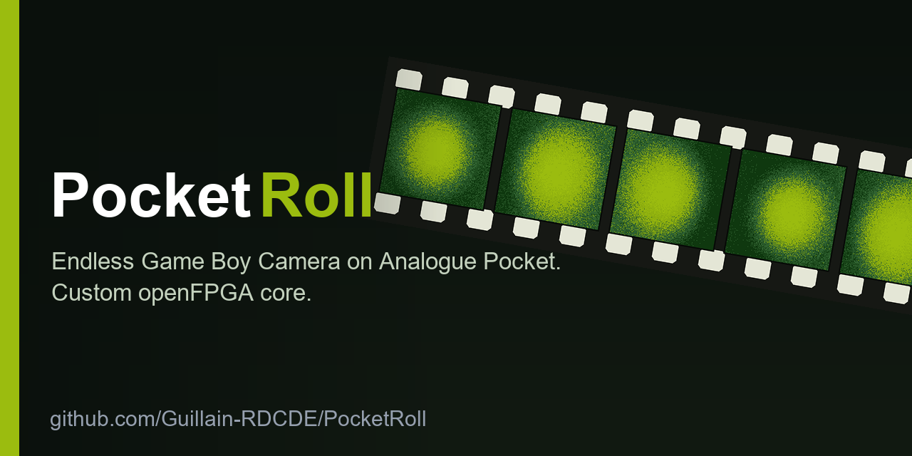

  

<h1 align="center">PocketRoll</h1>

  <em>An infinite roll of film for the 1998 Game&nbsp;Boy&nbsp;Camera — 
  on the Analogue&nbsp;Pocket, with no PC in the field.</em>

  <a href="https://guillain-rdcde.github.io/PocketRoll/"><b>Read the making-of&nbsp;→</b></a>
  &nbsp;&nbsp;·&nbsp;&nbsp;
  <a href="STORY.md">Plain-text version</a>
  &nbsp;&nbsp;·&nbsp;&nbsp;
  <a href="pocketroll/docs/">The research</a>

---

The Game Boy Camera, in 1998, could hold thirty photos — thirty, *total*, forever, until you deleted
some to make room. PocketRoll lifts that limit on the Analogue Pocket, using nothing but the console,
the original cartridge, and an SD card.

> ## &nbsp;An Infinite Roll — the making-of
>
> A save format that erases itself if you cheat. A bug that cost three days and was fixed by one
> character. A ROM nobody had ever disassembled. A screen that split in two. The full story of how a
> 1998 camera was taught to shoot forever — written as a long read that flows like a novel and
> unfolds, at a click, into the actual bytes, the Verilog and the disassembly.
>
> ### &nbsp;[Read the making-of&nbsp;→](https://guillain-rdcde.github.io/PocketRoll/)

Every photo you take with the **real cartridge** — its real sensor, passed live through a custom
openFPGA core — is archived to the SD card and its slot recycled, so the camera never runs out. The
result is an unlimited roll, developed at home with [MugDump](https://github.com/Guillain-RDCDE/MugDump).
No cables, no PC, no modification to the 1998 hardware.

## How it works

Three machines are stacked inside one another: the camera's **ROM**, which can see a sensor but has no
concept of a file; the **cartridge**, which physically holds the sensor and thirty frames; and beneath
both, the **FPGA core** — a Game Boy built from logic, the only layer that can reach the SD card.

PocketRoll leaves the cartridge and its sensor completely untouched, and rewrites the Game Boy
underneath. It notices each photo, copies it to the card, and patches the ROM's *film full* logic — as
the console reads it — into a cyclic roll that overwrites the oldest frame instead of refusing the next.
The camera never knows.

## What's inside

| Path | Contents |
|---|---|
| [`src/`](src/) · [`pkg/`](pkg/) | the openFPGA Game Boy core this project builds on |
| [`pocketroll/core/`](pocketroll/core/) | the core changes, build helpers, and testbench |
| [`pocketroll/docs/`](pocketroll/docs/) | the research and the war stories, documented in full |
| [`pocketroll/tools/`](pocketroll/tools/) | zero-dependency tools to read, verify and forge camera saves |

## The research

Verified by hand on real hardware, and in several cases documented nowhere else on the web.

- **The camera's checksum** — a running sum seeded at `0x2F` and an XOR at `0x15`, over the summary
  vector alone.  → [01 — SRAM save format](pocketroll/docs/01-game-boy-camera-sram-format.md)
- **Slot recycling** — reproducing the camera's own deletion to within six bytes.
  → [02 — slot recycling](pocketroll/docs/02-slot-recycling.md)
- **The Analogue Pocket `.sta` save state** — decoded from scratch.
  → [03 — saves explained](pocketroll/docs/03-game-boy-camera-saves-explained.md)
- **Sensor passthrough** — the real cartridge, sensor included, running live.
  → [04 — core architecture](pocketroll/docs/04-openfpga-core-architecture.md)
- **The core bring-up** — every black screen, and the hidden Pocket debug log that cracked them, with no
  JTAG.  → [06 — build & debug](pocketroll/docs/06-build-and-debug-war-story.md)
- **The dump** — why the photos must be read straight off the physical cartridge.
  → [07 — the dump saga](pocketroll/docs/07-the-dump-saga.md)
- **The ROM overlay** — the home-grown disassembly and the cyclic-roll patch in bank `$02`.
  → [11 — ROM disassembly](pocketroll/docs/11-rom-disasm-overwrite.md)
- **The save-state resume fix** — a physical-cartridge clock left free-running across the pause.
  → [12 — resume fix](pocketroll/docs/12-savestate-resume-handoff.md)

## Building it

The core builds with **Quartus Prime Lite 25.1** — the version its committed IP (PLLs and the rest) was
generated for. Versions 18.1 and 24.1 compile cleanly but produce a black screen on the Pocket.
`core_top.sv` must keep `` `define isgbc 0 `` (upstream leaves it at `1`, which builds the Game Boy
Color variant and boots to black). Full notes in
[`SETUP.md`](pocketroll/core/SETUP.md) and [`INTEGRATION.md`](pocketroll/core/INTEGRATION.md).

## Status

The infinite roll is complete and confirmed on hardware: shoot past thirty, the oldest frames recycle;
save-state to dump the photos — it resumes cleanly — and keep shooting. Next: a purpose-built
*camera-only* homebrew ROM running on the same core.

---

A fork of [budude2/openfpga-GBC](https://github.com/budude2/openfpga-GBC). All of budude2's original
work lives under [`src/`](src/) and [`pkg/`](pkg/), and the upstream README is preserved as
[`README.budude2.md`](README.budude2.md). The camera-format reverse-engineering stands on the work of
[Raphaël&nbsp;Boichot](https://github.com/Raphael-Boichot/Inject-pictures-in-your-Game-Boy-Camera-saves),
insideGadgets, and the [Pan&nbsp;Docs](https://gbdev.io/pandocs/Gameboy_Camera.html); `.sta` extraction
follows [Galkon/pokepocket-save-recovery](https://github.com/Galkon/pokepocket-save-recovery).
